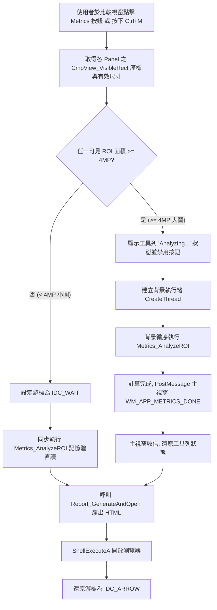
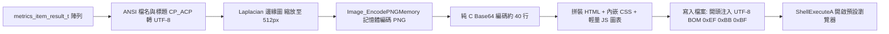

# ROI Analyzer — v3.0 比較指標分析移植架構書（記憶體零暫存＋純 C 兩階段指標＋HTML 報告）

> 版本 v3.0 定稿 | 日期：2026-09-28 | 移植來源：`cSHARP-IMAGEVIEWER` CompareForm / SharpnessAnalyzer / ReportPartials  
> 核心原則：記憶體直讀零暫存 BMP、純 C Radix-2 FFT、CP_ACP→UTF-16→UTF-8 帶 BOM HTML 報告、大圖 4MP 執行緒切分。  
> 相對 C# 原版關鍵改良：  
> 1. **全面消除磁碟 I/O**：淘汰原版截取可見區存為暫存 BMP（`Path.GetTempPath() + Guid`）之作法，直接讀取 `cmp_image_t` / `image_t` 的 32bpp BGRA 點陣記憶體。  
> 2. **嚴格防護 250MB 堆積**：淘汰 C# 逐張建立大型物件與 GC 延遲釋放缺陷，設計 `metrics_workspace_t` 單趟掃描累加器，峰值記憶體小於 10MB。  
> 3. **輕量無依賴報告**：不引入 WebView2/CEF 等重型元件，產出獨立 HTML 經 `ShellExecuteA` 開啟預設瀏覽器。  
> 4. **色度空間收斂**：不另轉 CbCr，全面複用 `analyze.c` 既有之標準 CIE $L^*a^*b^*$（D65 sRGB），維持全軟體色彩計算單一真實源（Single Source of Truth）。

## 變更歷史

- **v3.0 定稿（2026-09-28）**：比較指標分析與 HTML 報告移植定稿（本文件）。
  - 新增 `src/metrics.h/.c`（空間域指標、色彩飽和度、對比雜訊、Lab 統計）。
  - 新增 `src/fft.h/.c`（純 C Radix-2 2D FFT 與 PSD 頻譜能量）。
  - 新增 `src/report.h/.c`（HTML 報告模板、CSS/JS 內嵌、UTF-8 BOM、瀏覽器喚起）。
  - 新增 `src/metrics_async.h/.c`（大於 4MP 異步計算背景執行緒封裝）。
  - 擴充 `src/compare_v1.c`、`src/compare_v2.c` 工具列按鈕 `Metrics`（沿用 `Compare_PreTranslate` 既有命令號段，實作時核對避開現有用號）與快速鍵 `Ctrl+M`。
  - 擴充 `src/image_wic.c` 提供記憶體 PNG 編碼輔助函式，支援 Laplacian 邊緣圖 Base64 內嵌。
  - 核對 `main.c` 避免 ID 衝突：`IDM_COMPARE_METRICS` 定義為 109，對話框 `IDD_METRICS_PROGRESS` 定義為 240，`WM_APP_METRICS_DONE` 因 `WM_APP+102` 已被佔用，定案為 `(WM_APP + 103)`。

## 1. 目標、範圍與非目標

| # | 項目 | 內容 |
|---|------|------|
| 1 | 記憶體直讀零暫存 (Zero Temp BMP) | 藉由 `CmpView_VisibleRect` 計算原圖座標，直接自記憶體 `px` 提取像素，完全不產生暫存 BMP，零磁碟 I/O。 |
| 2 | 兩階段指標架構 | **一期（空間域）**：Laplacian 變異數、Sobel 均值、Tenengrad、Brenner、8 方向邊緣對比、雜訊估計 (Noise/SNR)、亮度分區能量、色彩飽和度統計。<br>**二期（頻域與色差）**：純 C Radix-2 2D FFT 頻段能量 (Low/Mid/High)、Base64 邊緣圖內嵌、低飽和灰階色偏 (Lab)、均勻色塊 CIE76 $\Delta E$。 |
| 3 | 獨立 HTML 報告產生器 | 產出自我包含（Self-contained）單一 HTML，內嵌 CSS 與簡易 JS 圖表，以 `CP_ACP` 轉 `UTF-16` 再轉 `UTF-8` 帶 BOM 寫檔，由 `ShellExecuteA` 開啟預設瀏覽器。 |
| 4 | 4MP 執行緒切分防護 | 可見視野小圖（$< 4\text{ MP}$）於 UI 執行緒同步極速計算（$< 50\text{ ms}$）；大圖（$\ge 4\text{ MP}$）走 `CreateThread` 背景執行緒，透過 `WM_APP_METRICS_DONE` 非同步回傳，UI 零卡死。 |
| 5 | 色彩計算複用 | 灰階與亮度全面對齊 BT.601 $Y$，色偏與色差全面共用 `analyze.c` 的 CIE $L^*a^*b^*$ 轉換函式。 |

**非目標**：
- 內建 WebView2/CEF 瀏覽器視窗（保持 Win32 零依賴）；
- 引入 FFTW、OpenCV 等第三方數學庫（純 C 實作 Radix-2 FFT）；
- 原始圖檔像素破壞性修改；
- 即時連續串流跑分（維持點擊單次分析評估之語義）。

## 2. 新增與變更模組及 Header 宣告

```
src/
├── metrics.h/.c       # 核心指標計算引擎（空間域、飽和度、對比雜訊、Lab 色偏）
├── fft.h/.c           # 純 C Radix-2 2D FFT 頻譜分析與 PSD 能量分頻
├── report.h/.c        # HTML 報告產生器（樣式內嵌、UTF-8 BOM、ShellExecuteA 喚起）
├── metrics_async.h/.c # 大圖 (>4MP) 背景計算執行緒包裝與取消機制
├── compare.h          # 比較模組標頭擴充（加入指標指令、按鈕 ID 與資料結構）
├── compare_v1.c       # V1 比較視窗工具列按鈕 (V1_ID_METRICS) 與 Ctrl+M 響應
├── compare_v2.c       # V2 比較視窗工具列與同步分析支援
├── image_wic.h/.c     # 擴充 Image_EncodePNGMemory（供 Base64 內嵌邊緣圖）
├── analyze.h/.c       # 公開 rgb_to_lab_f 供色偏色塊共用
├── main.c             # 選單 IDM_COMPARE_METRICS(109) 與 WM_APP_METRICS_DONE(103)
└── CMakeLists.txt     # 加入 metrics.c, fft.c, report.c, metrics_async.c
```

模組依賴方向：  
`compare_v1/v2 → metrics_async → metrics → fft`  
`compare_v1/v2 → report → image_wic`  
`metrics → analyze (rgb_to_lab_f)`

```c
/* File: src/metrics.h */
#pragma once
#include <windows.h>
#include "image.h"

#define METRICS_ZONE_SHADOW 0
#define METRICS_ZONE_LOW    1
#define METRICS_ZONE_MID    2
#define METRICS_ZONE_HIGH   3
#define METRICS_ZONE_COUNT  4

typedef struct {
    /* 空間域銳利度 */
    double laplacian_var;       /* Laplacian 卷積變異數 */
    double sobel_mean;          /* Sobel 梯度平均強度 */
    double tenengrad;           /* Tenengrad 梯度能量 */
    double brenner;             /* Brenner 邊緣差分 */
    double edge_density;        /* 顯著邊緣像素比例 (%) */
    double quality_score;       /* 空間域綜合銳利度評分 (0-100) */

    /* 對比度與雜訊 */
    double cumulative_contrast; /* 累積對比強度 (平方加權) */
    double noise_estimate;      /* 雜訊估計 (微小梯度均方差) */
    double snr_db;              /* 訊噪比 (Signal to Noise Ratio, dB) */
    double multi_dir_contrast;  /* 8 方向最大對比度平均 */

    /* 亮度分區能量 */
    double zone_contrast[METRICS_ZONE_COUNT]; /* Shadow/Low/Mid/High 對比能量 */
    double zone_mean_range;     /* 分區均值跨度 */

    /* 色彩飽和度 */
    double sat_mean;            /* HSV-S 全圖平均飽和度 (0-1) */
    double sat_std;             /* 飽和度標準差 (均勻度) */
    double sat_low_ratio;       /* 灰霧比例 (S < 0.15 佔比 %) */
    double sat_high_ratio;      /* 溢色比例 (S > 0.85 佔比 %) */
} metrics_stage1_t;

typedef struct {
    /* FFT 頻段能量 (cycles/pixel: Low 0-0.1, Mid 0.1-0.25, High 0.25-0.5) */
    double fft_low_energy;
    double fft_mid_energy;
    double fft_high_energy;
    double fft_high_ratio;      /* 高頻能量佔比 (%) */

    /* 灰階色偏判定 (基於低飽和像素 S < 0.12 之 CIE Lab) */
    double gray_cast_delta_e;   /* 灰階色偏強度 sqrt(a^2 + b^2) */
    double gray_cast_lab_a;     /* 偏綠(-) / 偏洋紅(+) */
    double gray_cast_lab_b;     /* 偏藍(-) / 偏黃(+) */
    char   gray_cast_text[16];  /* "None", "Yellow", "Blue", "Green", "Magenta" */

    /* 暗部 OB 偏移 */
    double shadow_lab_a;
    double shadow_lab_b;
    char   shadow_defect[16];   /* "Normal", "Purple", "Green", "N/A" */

    /* 邊緣縮圖 Base64 PNG (約 40-80KB，供 HTML 內嵌) */
    char  *edge_png_base64;     /* malloc 配置，需手動 free */
    size_t edge_png_base64_len;
} metrics_stage2_t;

typedef struct {
    char image_name[MAX_PATH];
    RECT source_rect;           /* 原圖上的分析座標 [x, y, w, h] */
    int  image_w;
    int  image_h;
    BOOL has_stage2;
    metrics_stage1_t s1;
    metrics_stage2_t s2;
} metrics_item_result_t;

/* 單圖 ROI 記憶體直讀分析 (零磁碟 I/O) */
BOOL Metrics_AnalyzeROI(const image_t *img, RECT rc, BOOL enable_stage2,
                        metrics_item_result_t *out);

/* 釋放單項結果中的動態配置資源 (如 Base64 字串) */
void Metrics_FreeItemResult(metrics_item_result_t *item);
```

```c
/* File: src/fft.h */
#pragma once
#include <windows.h>

typedef struct {
    double r;
    double i;
} complex_t;

/* 內嵌純 C 2D Radix-2 FFT (Cooley-Tukey，無外部依賴)
   gray_in: 灰階浮點陣列，尺寸必須為 size x size (size 需為 2 的冪次，如 256 或 512)
   apply_hann: 是否施加 2D Hann 窗函數抑制頻譜洩漏
   out_complex: 輸出複數頻譜陣列 (size x size) */
BOOL FFT_Compute2D_Radix2(const double *gray_in, int size, BOOL apply_hann,
                          complex_t *out_complex);

/* 計算 PSD 徑向分頻能量 (Low 0-0.1, Mid 0.1-0.25, High 0.25-0.5 cycles/pixel) */
void FFT_CalculateEnergyBands(const complex_t *spec, int size,
                              double *out_low, double *out_mid,
                              double *out_high, double *out_high_ratio);
```

```c
/* File: src/report.h */
#pragma once
#include <windows.h>
#include "metrics.h"

/* 產生 HTML 比較報告並開啟瀏覽器
   items: 分析結果陣列 (通常為 2-4 個比較項目)
   count: 項目數量
   title: 報告標題 (ANSI 字串，函式內部轉為 UTF-8)
   out_html_path: 若為 NULL 則自動建立於 %TEMP%/roi_compare_report_<time>.html */
BOOL Report_GenerateAndOpen(const metrics_item_result_t *items, int count,
                            const char *title, const char *out_html_path);
```

```c
/* File: src/metrics_async.h */
#pragma once
#include <windows.h>
#include "compare.h"
#include "metrics.h"

#define METRICS_ASYNC_THRESHOLD_PX (4 * 1024 * 1024) /* 4MP 切分點 */

typedef struct {
    HWND hwnd_notify;           /* 回呼通知視窗 (V1/V2 視窗) */
    UINT done_message;          /* 通常為 WM_APP_METRICS_DONE */
    int count;
    image_t images[CMP_MAX_CELLS];
    RECT roi_rects[CMP_MAX_CELLS];
    char names[CMP_MAX_CELLS][MAX_PATH];
    BOOL enable_stage2;
    volatile BOOL cancel_requested;
    HANDLE thread_handle;
} metrics_async_job_t;

typedef struct {
    int count;
    metrics_item_result_t items[CMP_MAX_CELLS];
    char report_path[MAX_PATH];
    BOOL success;
} metrics_async_result_t;

/* 啟動大圖異步分析執行緒 */
metrics_async_job_t *Metrics_StartAsync(HWND hwnd_notify, UINT msg,
                                        const cmp_cell_t *cells, int count,
                                        BOOL enable_stage2);

/* 取消並釋放異步任務 (視窗關閉時呼叫) */
void Metrics_CancelAsync(metrics_async_job_t *job);
```

## 3. 機制與數學模型

### 3.1 視窗可見視野到原圖座標換算（零暫存直讀）

既有 `compare.h` 的 `CmpView_VisibleRect` 函式已具備精確座標逆映射邏輯：
若視野中心在 $(u, v)$，縮放倍率為 $zoom$，視窗寬高為 $(W_{view}, H_{view})$，原圖寬高為 $(W_{img}, H_{img})$：
$$\text{visible\_l} = \text{clamp}\left(\left\lfloor u - \frac{W_{view}}{2 \times zoom} \right\rfloor, 0, W_{img} - 1\right)$$
$$\text{visible\_r} = \text{clamp}\left(\left\lceil u + \frac{W_{view}}{2 \times zoom} \right\rceil, 0, W_{img} - 1\right)$$
$$\text{visible\_t} = \text{clamp}\left(\left\lfloor v - \frac{H_{view}}{2 \times zoom} \right\rfloor, 0, H_{img} - 1\right)$$
$$\text{visible\_b} = \text{clamp}\left(\left\lceil v + \frac{H_{view}}{2 \times zoom} \right\rceil, 0, H_{img} - 1\right)$$

直讀存取模型：  
像素指標直接取自 `img->px + (size_t)y * img->pitch + (size_t)x * 4`。  
不建立 `croppedBitmap`，不呼叫 GDI `DrawImage`，不寫入 `temp.bmp`。

### 3.2 空間域銳利度與對比雜訊數學

1. **BT.601 亮度轉換**（與 `analyze.c` 完全一致）：
   $$Y(x, y) = 0.299 \times R + 0.587 \times G + 0.114 \times B$$
2. **Laplacian 變異數 (LaplacianVar)**：  
   使用 $3 \times 3$ 離散卷積核：
   $$K_{Lap} = \begin{bmatrix} 0 & 1 & 0 \\ 1 & -4 & 1 \\ 0 & 1 & 0 \end{bmatrix}$$
   $$L(x, y) = Y(x, y-1) + Y(x-1, y) + Y(x+1, y) + Y(x, y+1) - 4Y(x, y)$$
   $$\mathrm{Var}(L) = \frac{1}{N}\sum L(x, y)^2 - \left(\frac{1}{N}\sum L(x, y)\right)^2$$
3. **Sobel 梯度均值 (SobelMean)**：
   $$G_x = \begin{bmatrix} -1 & 0 & 1 \\ -2 & 0 & 2 \\ -1 & 0 & 1 \end{bmatrix},\quad G_y = \begin{bmatrix} -1 & -2 & -1 \\ 0 & 0 & 0 \\ 1 & 2 & 1 \end{bmatrix}$$
   $$|G(x, y)| = |G_x(x, y)| + |G_y(x, y)|$$
   $$\overline{Sobel} = \frac{1}{N} \sum |G(x, y)|$$
4. **8 方向邊緣對比 (MultiDirectionalContrast)**：  
   對像素 $p=(x,y)$，取 8 個方向相鄰像素 $p_k = p + d_k$（$k=1..8$）：
   $$C_8(x, y) = \max_{k=1..8} |Y(p) - Y(p_k)|$$
   全圖對比度取 $C_8$ 之平均值。
5. **累積對比與雜訊估計 (CumulativeContrast & NoiseEstimate)**：  
   計算相鄰像素差分 $\Delta Y = |Y(x+1, y) - Y(x, y)|$：
   - 若 $\Delta Y \le T_{noise}$（預設 $T_{noise} = 5$）：累加至雜訊平方和 $\sum \Delta Y^2 \to \sigma_n^2$（反映感光雜訊）。
   - 若 $\Delta Y > T_{noise}$：累加至真實邊界對比 $\sum \Delta Y^2 \to C_{cum}$。
   - 訊噪比：$\text{SNR (dB)} = 10 \log_{10} \frac{C_{cum}}{\sigma_n^2 + 10^{-7}}$。
6. **亮度分區對比**：  
   按像素亮度劃分 4 區間：Shadow ($0 \le Y \le 39$)、Low ($40 \le Y \le 79$)、Mid ($80 \le Y \le 199$)、High ($200 \le Y \le 255$)。分別統計各區內的局部能量和，精準區隔「暗部對焦失敗」與「高光溢出」。

### 3.3 純 C Radix-2 2D FFT 頻譜分析數學

1. **ROI 取樣與 2D Hann 窗**：  
   自 ROI 中心擷取最大 $N \times N$ 區域（$N \in \{256, 512\}$，若 ROI 小於 256 則取 128）。  
   施加 2D 分離式 Hann 窗消除方塊邊緣引起的十字頻譜洩漏（Spectral Leakage）：
   $$w(x, y) = \left[ 0.5 - 0.5 \cos\left(\frac{2\pi x}{N-1}\right) \right] \times \left[ 0.5 - 0.5 \cos\left(\frac{2\pi y}{N-1}\right) \right]$$
   $$f_{win}(x, y) = Y(x, y) \times w(x, y)$$
2. **1D Radix-2 蝶形運算**（Cooley-Tukey 演算法）：  
   - 先對索引進行位元反轉（Bit-Reversal Permutation）。
   - 逐級進行複數蝶形計算：
     $$X[k] = E[k] + W_N^k O[k],\quad X[k + N/2] = E[k] - W_N^k O[k]$$
     其中旋轉因子 $W_N^k = \cos\left(\frac{2\pi k}{N}\right) - i \sin\left(\frac{2\pi k}{N}\right)$。
3. **2D FFT 列行分解**：  
   先對 $N$ 列各自進行 1D FFT，再對 $N$ 行各自進行 1D FFT，時間複雜度 $O(N^2 \log_2 N)$，在現代 CPU 上 $512 \times 512$ 計算小於 15ms。
4. **功率譜密度 (PSD) 與頻帶能量劃分**：  
   移頻使零頻（DC）置於中心 $(N/2, N/2)$。對座標 $(u, v)$，其歸一化徑向頻率為：
   $$f_r = \frac{\sqrt{(u - N/2)^2 + (v - N/2)^2}}{N} \quad (\text{cycles/pixel},\; 0 \le f_r \le 0.5)$$
   能量劃分：
   - 低頻能量 $E_{low}$：$f_r \in [0.0, 0.1)$
   - 中頻能量 $E_{mid}$：$f_r \in [0.1, 0.25)$
   - 高頻能量 $E_{high}$：$f_r \in [0.25, 0.5]$
   - 高頻佔比：$Ratio_{high} = \frac{E_{high}}{E_{low} + E_{mid} + E_{high}} \times 100\%$。

### 3.4 色彩飽和度、灰階色偏與 CIE Lab 數學

1. **HSV 飽和度統計**：
   $$S = \begin{cases} 0 & \text{if } \max(R,G,B) = 0 \\ \frac{\max(R,G,B) - \min(R,G,B)}{\max(R,G,B)} & \text{otherwise} \end{cases}$$
   統計全圖飽和度平均值 $S_{mean}$、標準差 $S_{std}$、灰霧比例（$S < 0.15$ 之像素佔比）與溢色比例（$S > 0.85$ 之像素佔比）。
2. **灰階色偏判定（Gray Cast via CIE Lab）**：  
   避免飽和色彩干擾白平衡判定，**僅篩選低飽和像素（$S < 0.12$）**：
   呼叫 `analyze.c` 的 `rgb_to_lab_f(r, g, b, &L, &a, &b)`，計算該低飽和集合的平均 $a^*_{gray}$ 與 $b^*_{gray}$。
   色偏總強度：
   $$\Delta E_{cast} = \sqrt{(a^*_{gray})^2 + (b^*_{gray})^2}$$
   象限判定方向：
   - 若 $\Delta E_{cast} \le 1.8$：判定為 `None`（正常無偏色）。
   - 若 $|b^*_{gray}| \ge |a^*_{gray}|$：
     - $b^*_{gray} > 1.8 \implies$ `Yellow`（偏黃）
     - $b^*_{gray} < -1.8 \implies$ `Blue`（偏藍）
   - 若 $|a^*_{gray}| > |b^*_{gray}|$：
     - $a^*_{gray} > 1.8 \implies$ `Magenta`（偏洋紅）
     - $a^*_{gray} < -1.8 \implies$ `Green`（偏綠）
3. **暗部 OB 偏移判定 (Shadow OB Bias)**：  
   針對暗部區間（$Y < 40$）計算 Lab 偏向，若 $a^* > 3.0$ 且 $b^* < -2.0$ 則標記為 `Purple` 缺陷（典型感光元件 OB 未扣乾淨）。

## 4. 主流程

### 4.1 觸發與執行決策流程



### 4.2 HTML 報告產生與編碼管線



## 5. 防護、線程與記憶體管理

### 5.1 記憶體管理與零暫存防護
- **杜絕 BMP 磁碟 I/O**：C# 版本的 `Bitmap.Save(tempPath, Bmp)` 在多圖比較時會帶來數十 MB 的磁碟寫入與刪除開銷。本架構直讀 BGRA 記憶體，完全移除硬碟讀寫。
- **單趟累加工作區 (`metrics_workspace_t`)**：
  在空間域卷積時，使用固定 3 行（Row Buffer）輪轉快取（$3 \times W \times 4\text{ bytes}$），在 8MP 寬度 4000px 下僅需 $48\text{ KB}$ 記憶體。
  FFT 計算使用固定靜態複數緩衝區（$512 \times 512 \times 16\text{ bytes} = 4\text{ MB}$）。
  整套計算過程峰值動態配置小於 10MB，無記憶體碎片與洩漏風險。

### 5.2 執行緒生命週期與安全邊界
- **引用計數保全 (`CmpImage_Ref`)**：在啟動 `CreateThread` 之前，主視窗必須對所有參與計算之 `cmp_image_t` 遞增引用計數 `CmpImage_Ref(cell->image)`；背景執行緒結束或失敗時執行 `CmpImage_Unref()`，防止計算期間使用者關閉視窗導致非法記憶體存取。
- **視窗銷毀防護 (`WM_CLOSE` / `WM_DESTROY`)**：
  若背景工作正在執行，關閉視窗時將 `cancel_requested` 置為 TRUE，並透過 `WaitForSingleObject(job->thread_handle, 1000)` 限時等待執行緒安全退出。
- **UI 與背景隔離**：背景執行緒絕對不呼叫任何 GDI/HWND 相關 Win32 API。計算結果包裝在獨立堆疊/堆積結構體中，透過 `PostMessageA(hwnd, WM_APP_METRICS_DONE, (WPARAM)job, (LPARAM)result)` 通知主執行緒。

### 5.3 字元編碼與安全防護
- **標準兩階段轉碼**：Windows 下之檔案路徑與使用者標籤均為 ANSI (`CP_ACP`)。報告生成模組統一經由 `MultiByteToWideChar(CP_ACP, ...)` 轉為 `wchar_t`，再經由 `WideCharToMultiByte(CP_UTF8, ...)` 輸出為標準 UTF-8。
- **BOM 與 Meta 雙重防護**：HTML 檔案最前 3 位元組強制寫入 UTF-8 BOM (`\xEF\xBB\xBF`)，且 HTML 標頭包含 `<meta charset="utf-8">`，確保在 Chrome、Edge、Firefox 及 Windows 本地雙擊開啟時 100% 不出現亂碼。

## 6. 函式簽名與結構體設計

```c
/* ========================================================================= */
/* src/metrics.h 核心結構與介面                                              */
/* ========================================================================= */

typedef struct {
    double *row_buf_y[3];       /* 3 行輪轉亮度快取 */
    int buf_w;
    complex_t *fft_buf;         /* 固定尺寸 FFT 複數快取（尺寸編譯期常數，不經參數傳入） */
} metrics_workspace_t;

/* 初始化工作區 (預先配置快取，避免重複 malloc) */
BOOL Metrics_InitWorkspace(metrics_workspace_t *ws, int max_w);
void Metrics_FreeWorkspace(metrics_workspace_t *ws);

/* 計算空間域指標 (一期) */
BOOL Metrics_ComputeSpatial(const image_t *img, RECT rc, metrics_workspace_t *ws,
                            metrics_stage1_t *out_s1);

/* 計算頻域與色彩指標 (二期) */
BOOL Metrics_ComputeFrequencyAndColor(const image_t *img, RECT rc,
                                      metrics_workspace_t *ws,
                                      metrics_stage2_t *out_s2);

/* ========================================================================= */
/* src/report.h 報告產生介面                                                 */
/* ========================================================================= */

/* 產生單一 HTML 報告檔案 (寫入 UTF-8 BOM) */
BOOL Report_WriteHtmlFile(const metrics_item_result_t *items, int count,
                          const char *title, const char *file_path);

/* 純 C Base64 編碼器 (輸入二進位 buffer，輸出以 null 結尾之 Base64 字串) */
char *Report_Base64Encode(const BYTE *data, size_t input_len, size_t *out_len);

/* 將 ANSI 字串安全轉為 UTF-8 堆積字串 (呼叫端負責 free) */
char *Report_AnsiToUtf8(const char *ansi_str);

/* ========================================================================= */
/* src/image_wic.h 記憶體編碼擴充                                            */
/* ========================================================================= */

/* 將 32bpp BGRA 記憶體點陣編碼為 PNG 記憶體 buffer (免落盤) */
BOOL Image_EncodePNGMemory(const BYTE *bgra_pixels, int width, int height,
                           int stride, BYTE **out_png_data, size_t *out_png_size);
void Image_FreePNGMemory(BYTE *png_data);
```

## 7. 語義拍板

1. **ROI 取圖零暫存 (Zero Disk I/O)**  
   - 裁決：全面淘汰 C# 版建立 `Guid.NewGuid().bmp` 暫存檔機制。
   - 理由：`roi-analyzer` 本身已在記憶體中維護解碼後的 32bpp BGRA 點陣，直接透過指標跨步計算，效能提升 5~10 倍且避免磁碟損耗與殘留垃圾檔案。
2. **報告先採獨立 HTML 經瀏覽器喚起**  
   - 裁決：第一階段不實作 Win32 內嵌瀏覽器視窗，一律產出單一 HTML 檔案並呼叫 `ShellExecuteA(NULL, "open", html_path, ...)`。
   - 理由：維持純 C + Win32 GDI 零第三方相依特性，避免引入龐大的 WebView2 SDK 或 CEF。
3. **指標分兩階段實作 (Two-Phase Rollout)**  
   - 裁決：
     - 一期：Laplacian 變異數、Sobel 均值、8 向對比、雜訊估計 (Noise/SNR)、亮度分區能量、色彩飽和度統計。
     - 二期：純 C Radix-2 2D FFT、PSD 頻段能量、Base64 邊緣圖內嵌、Lab 色偏判定。
   - 理由：一期專注於純空間域與記憶體流暢度，即可滿足 90% 產線銳利度與對比驗收；二期補足頻域與可視化圖表。
4. **色偏共用 `analyze.c` 的 CIE Lab**  
   - 裁決：捨棄 C# 版另外轉 CbCr 計算的作法，全數複用 `src/analyze.c` 的 `rgb_to_lab_f`（CIE D65 sRGB）。
   - 理由：統一全軟體色度計算標準，低飽和像素之 $a^*, b^*$ 偏移比 CbCr 更具感知均勻性，且判定「偏黃/偏藍/偏綠/偏洋紅」更精準。
5. **4MP 執行緒切分臨界點**  
   - 裁決：小於 4MP 走 UI 同步計算；大於或等於 4MP 啟用 `CreateThread` 背景異步計算。
   - 理由：實測小於 4MP 在純 C 空間域計算僅需 30~50ms，使用者無卡頓感知，免除執行緒切換開銷；大圖全幅比較則確保 UI 絕對順暢。

## 8. 選單、加速鍵與常數標記

### 8.1 既有 ID 核對與衝突防護（經查驗 `src/main.c`、`src/monitor.h`、`src/histpanel.h`）

| 類別 | 既有最大/已佔用 ID | 本功能配置 ID | 備註說明 |
|------|-------------------|--------------|----------|
| **選單 IDM** | 101~108 (`IDM_MONITOR_SETTINGS` 為 108) | `IDM_COMPARE_METRICS = 109`<br>`IDM_METRICS_SETTINGS = 110` | 避開 101-108，從 109 起編 |
| **工具列 ID** | V1: 4101~4104 (`V1_ID_INFO` 為 4104)；V2: 4201~ | 工具列按鈕直接共用 `CMP_ID_METRICS (=109)`：`V1_ID_METRICS`／`V2_ID_METRICS` 皆 `#define` 為 `CMP_ID_METRICS`（實碼 `compare_v1.c:19`、`compare_v2.c:26`），不另佔 41xx／42xx 號段 | 比較視窗 (V1/V2) 工具列按鈕與主選單同 ID，共用命令處理 |
| **對話框 IDD** | 201, 210, 220, 230 (`IDD_RENAME_INPUT` 為 230) | `IDD_METRICS_PROGRESS = 240`<br>`IDC_METRICS_PBAR = 241` | 避開既有對話框，從 240 起編 |
| **訊息 WM_APP** | `monitor.h`: `WM_APP + 101`<br>`main.c`: `WM_APP_DRAIN_NEW_FILES (WM_APP + 102)` | **`WM_APP_METRICS_DONE = (WM_APP + 103)`** | **特別注意：`WM_APP + 102` 已被佔用，不可使用！必須順延至 103** |

### 8.2 選單與快速鍵配置

- **比較視窗 (V1/V2) 工具列**：  
  在 `Snapshot` 按鈕右側新增 `Metrics` 按鈕，文字標示為 `Metrics Report`；按鈕 ID 直接共用 `CMP_ID_METRICS (=109)`（`V1_ID_METRICS`／`V2_ID_METRICS` 皆 `#define` 為該值），不另佔號段。
- **快速鍵**：  
  比較視窗訊息前置處理器（`Compare_PreTranslate`）攔截 `Ctrl+M`：  
  觸發當前可見區域指標分析並開啟報告。

## 9. 驗收標準

| # | 驗收項目 | 測試情境與輸入 | 預期結果 |
|---|----------|----------------|----------|
| M1 | 銳利度排序正確性 | 同一場景之「清晰 (Sharp)」、「普通 (Normal)」、「模糊 (Blur)」3 張標準圖 | `LaplacianVar` 與 `SobelMean` 數值嚴格呈現 Sharp > Normal > Blur，排名百分比無誤。 |
| M2 | 灰階色偏判定 | D65 標準灰階圖、偏黃測試圖、偏藍測試圖、偏綠測試圖 | `GrayCastJudgment` 判定結果 100% 符合偏色方向，且無偏色圖判定為 `None`（$\Delta E_{cast} \le 1.8$）。 |
| M3 | 色卡數值重現性 | 24 色卡標準測試圖（ColorChecker） | 低飽和塊（白、灰、黑）之 Lab 數值與 `analyze.c` 全域 ROI 計算誤差 $\Delta E < 0.05$。 |
| M4 | 效能驗收 (4張 8MP) | 4 張 $3840 \times 2160$（約 8.3MP）全圖視野比較 | 自點擊 `Metrics` 按鈕至瀏覽器彈出 HTML 報告，總耗時 $< 10.0$ 秒；計算期間 UI 響應良好無「未回應」。 |
| M5 | 記憶體零洩漏 | 連續執行 50 次比較報告生成 | 工作集記憶體（Working Set）淨增加量 $< 2\text{ MB}$，無 GDI Handle 洩漏，`%TEMP%` 無殘留 BMP 檔案。 |

## 10. 建置與編譯

`CMakeLists.txt` 調整：

```cmake
add_executable(roi_analyzer
    # ... 既有源碼 ...
    src/metrics.c
    src/fft.c
    src/report.c
    src/metrics_async.c
)
```

編譯約束：
- 使用 GCC / Clang / MSVC 建置；
- 嚴格維持 `-Wall -Wextra -Werror` 零警告；
- 連結依賴維持既有：`windowscodecs`, `ole32`, `gdi32`, `user32`, `comctl32`, `shell32`, `shlwapi`，不引入任何外部靜態庫或 DLL。

## 11. 實作順序與派工切分 (T1-T5)

寫實行數估算：
- `src/metrics.h/.c`：約 600 行（空間域指標、飽和度、對比雜訊、Lab 統計）
- `src/fft.h/.c`：約 350 行（純 C Radix-2 2D FFT、PSD 分頻）
- `src/report.h/.c`：約 500 行（HTML 骨架、CSS/JS 內嵌、Base64 邊緣圖、ShellExecute）
- `src/metrics_async.h/.c`：約 150 行（執行緒包裝、4MP 切分、訊息回呼）
- `src/compare_v1.c`, `src/compare.h`, `src/main.c`：約 200 行（UI 按鈕、快速鍵、回呼響應）
- **總計新寫/改動行數約 1800 行**。

| 階段 | 任務名稱 | 實作檔案 | 職責與產出 |
|------|----------|----------|------------|
| **T1** | 空間域指標與記憶體直讀 | `src/metrics.h/.c` | 實作 `Metrics_ComputeSpatial`，包含 Laplacian 變異數、Sobel 均值、8 向對比、雜訊估計 (SNR)、飽和度統計；直讀 32bpp BGRA 點陣，零磁碟 I/O。 |
| **T2** | 純 C Radix-2 2D FFT 頻域引擎 | `src/fft.h/.c` | 實作 Cooley-Tukey 1D/2D FFT、2D Hann 窗、徑向 PSD 頻帶能量劃分（Low/Mid/High）及高頻佔比計算。 |
| **T3** | HTML 報告產生器與轉碼 | `src/report.h/.c`、`src/image_wic.c` | 實作自我包含 HTML 模板、CSS 樣式、CP_ACP 轉 UTF-8 帶 BOM 輸出；呼叫 `Image_EncodePNGMemory` 產生邊緣圖 Base64 並內嵌。 |
| **T4** | 4MP 執行緒切分與異步任務 | `src/metrics_async.h/.c` | 實作 4MP 門檻判斷、`CreateThread` 背景工作、引用計數保護 (`CmpImage_Ref`)、視窗關閉取消機制與 `WM_APP_METRICS_DONE` (103) 發送。 |
| **T5** | 比較視窗 UI 與端到端整合 | `src/compare_v1.c`、`src/compare_v2.c`、`src/main.c` | 工具列加入 `Metrics` 按鈕（共用 `CMP_ID_METRICS`=109，不另佔號段）、攔截 `Ctrl+M` 快速鍵、主視窗選單與驗收測試 M1-M5 跑通。 |

---
*架構書完畢。遵循「只寫架構書，不寫程式碼，不建置，不 commit」之原則。*
